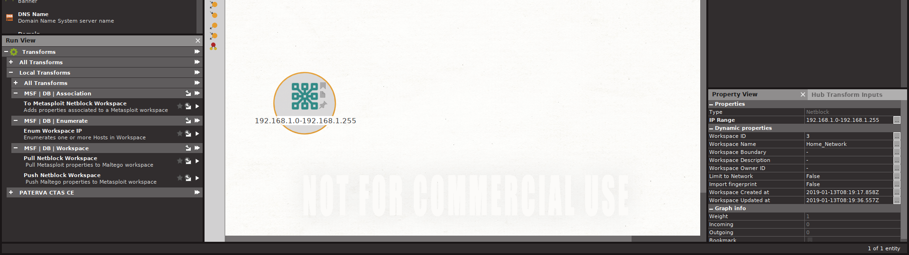
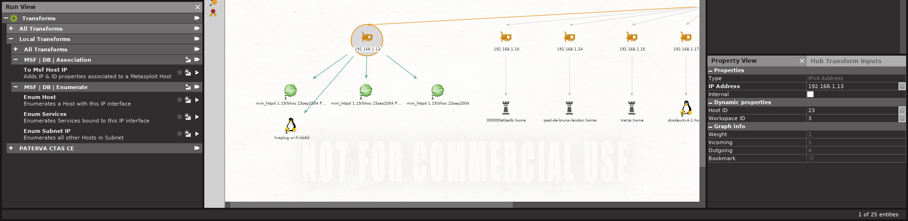
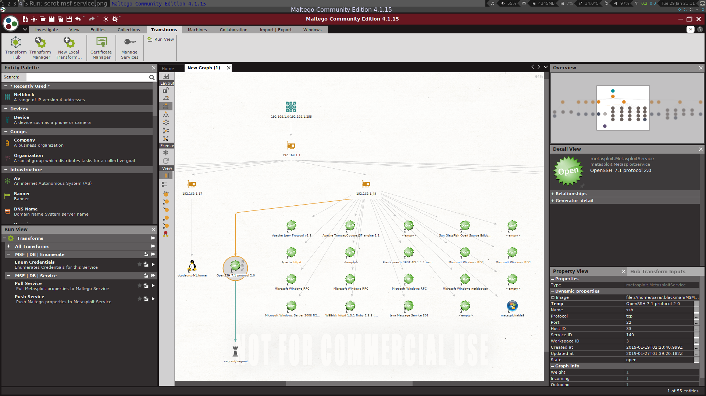

Effective Couscous - Metasploit Maltego
================================================================

  OVERVIEW 
-----------------------------------

Effective-Couscous is a set of Maltego Transforms that interact with various security-related tools, 
among which is the Metasploit Framework. Metasploit is used in this description to illustrate the intents
and aims of this project. Later on, other tools will be integrated in the same manner.
The transforms, at the higher level, either:

*   Act upon data stored in the Metasploit Database, mainly through its REST API.
*   Execute commands of the Metasploit Framework, mainly through its RPC server.

If well combined, Metasploit and Maltego can greatly benefit each other, and therefore the 
penetration tester using them. Maltego is here to be considered as a sort of "meta-framework" 
which would manage a complex, versatile set of data and expose it to various tools, such as the 
Metasploit Framework. 
This is conditioned by sound, balanced and focused integration of Metasploit toolsets in Maltego.
The major benefits would be:

*   Exhaustive, flexible and versatile representation/visualisation of Metasploit Data 
    into Maltego's entity graphs. Computer networks of various kinds, comprising various objects,
    can be viewed with accurate topology representation, multi-layer information, etc...
    Each host, netblock exposes various kinds of data, which can be further used as input to
    other transforms. The graph environment allows use of icons, which can be leveraged in many
    ways for Metasploit entities and their state.
      
*   Focused, context-sensitive availability of Metasploit toolset into Maltego. Netblocks
    can become workspaces, as well as hosts, so that they can selfishly profit from Metasploit
    workspace structure. Host, services, sessions, or consoles are entities upon which one
    can act, exactly like in the Metasploit console. Sessions, for instance, should offer the
    right subset of their tools in the Maltego graph. 
    
*   Various layers of information can be integrated into one Maltego graph, or can be separated
    into multiple Maltego graphs. For example, mapping Metasploit routes can be done in such a
    layer. It could be then used to further visualize Metasploit related traffic, and potential
    "points of application" can be identified for further scans, exploits, etc...
    Separate graphs can be used for a particular host, subnet, document set, website struture.

*   In addition to Maltego free transform set, various transform librairies can be paid for and
    used. A correct integration of Metasploit entities into Maltego entity structure can expose
    Metasploit-stored data to transforms unrelated to Metasploit. This might apply to Loot,
    Notes, files, passwords, mail addresses, etc...
    Another example is to imagine other tools integrated into Maltego, such as Nmap operations,
    on a host entity, a netblock entity, a service in a netblock, etc...

<!-- *A demonstration of Maltego transforms interacting with Metasploit Database. (Much faster than what -->
<!-- the Gif demo implies.)* -->
<!--   -->

  PAST APPROACHES
-----------------------------------

Every Metasploit user knows that versatile is paramount, but excessive is meaningless. 
The meaning of "framework" in Metasploit is subtile, and extending it with a GUI component consequently is.
The same thing applies to numerous tools and frameworks in computer security.

1.  **Armitage**, the old GUI that seems not to be supported anymore, would bring some sort of context-sentivity
    for exposing Metasploit tools, sessions, modules and consoles. However, the graphical representation of
    the network would be way too primary, with only a small variety of figures.
    In addition, Armitage would only CONSUME data from the Metasploit Database, and would not expose it to
    other tools (except from db_nmap).

2.  **Pro Consoles** obviously offer a much broader toolset than the Metasploit Framework. However, the approach
    of these tools with regard to network data visualization is not perfect. It is mainly composed of lists,
    processed and acted upon with various statistical tools, as well as systematic vulnerability testing
    capacities.
    This approach is only possible for the owner of the system, because he knows how to explain the noise.
    He does not have time to try every single path with a human eye. Therefore, and even if these tools have
    an undeniable use case, they are not fully adapted to red teams.
    As well, but to a smaller extent than Armitage, professional software might not expose their data to 
    external tools while keeping it in their own GUI.

  IMPLEMENTATIONS
-----------------------------------

Several attempts (Sploitego, MSploitego) have been made at interfacing Metasploit with Maltego. 
They represents dozens, hundreds of thoughtful iterations. They are definitely an unvaluable 
help for this project. However, building the optimal interface is complex, and requires both 
careful planning and the good libraries. 
These attempts might have lacked either:

*   The Metasploit Web Service API (JSON), for exhaustive and versatile consumption
    of the Metasploit Database content, with easy-to-manage auth.

*   As a consequence of the first lack, the granularity of interactions with Metasploit
    database was weak.
    Example: A database could only output all hosts -or services- at a time, with 
    no filtering possibility. There was also no possibility of modifying the data 
    in the DB directly from Maltego.
    See "2/Database Interaction" in next section.

*   Easy-to-use Python RPC librairies for session/console management.

*   Sub-optimal fusion of Metasploit workspaces with different entities in 
    Maltego (IPv4Address, Netblock, MsfHost), which seems to lead to a flawed 
    representation of a network's topology (functional, geographical, etc). 
    Example: See "1/Workspace Integration" in next section.

*   Unclear/unbounded integration of Metaploit's object model into Maltego's
    Entity model. Consequently, efficiently consuming (get/post) Metasploit DB
    was complicated, and would have been more as the number of entities/transforms/
    tools would grow.
    Example: How to represent the variety of operating systems, websites, services,
    while not making their management too difficult ?

*   Abusive integration of non-MSF tools into the set of transforms, which 
    has the effect of excessively "scoping" these entities and their transforms.
    This results in Metasploit entities in Maltego that cannot benefit from other 
    transform sets. As well, integration would often be about vulnerability scanners 
    which, as said above, are not primordial tools to integrate first, as they do not 
    really fit the constraints of red teams in terms of discretion.

  DATA MODEL
-----------------------------------

Integration of Metasploit objects into a Maltego-conforming object-hierarchy is of paramount importance,
as it conditions the success of this project. Upon acknowledgement of each framework's strengths,
some arbitrary choices are needed to preserve them:

### Workspace Integration
*    **Observation:**
        Maltego is efficient at representing network structures from a functional standpoint.
        Yet it can actually represent numerous kinds of networks, not only ones made of computer
        systems.
        On the other hand, Metasploit heavily relies on the use of Workspaces, which have their
        own limitations, such as having different class C networks in the same workspace.
        MSF workspaces however greatly help with loot, creds, and services management.
*    **Choice:**
    -   There are no Workspace Entities in Maltego. Because a workspace imposes boundaries
        only on Metasploit work, and that it can englobe either a single host, netblock or
        multiples ones, it should not interfere in Maltego' representation of data. 
    -   Therefore, in Maltego a workspace is simply a set of dynamic properties that are 
        added to a Maltego Entity, such as a Netblock or a Host.
    -   From this "entity-as-workspace", can be retrieved things such as credentials applying 
        to a whole domain, or to a host computer.
    -   Even a single host can be a workspace, and its IP being the workspace boundary, and maybe 
        even opened in a different graph.

*Netblock entity tied to a workspace with dynamic properties, and transforms dedicated to workspace*
 

### Database Interaction
*    **Observation:**
        The Metasploit JSON API offers a high level of granularity. Therefore one needs to determine how 
        is to be used this granularity.
        Example: A credential has a full set of nested attributes, by which it is possible to filter after
        receiving the JSON dict.
        But some of these attributes are not useful as filters.
*    **Choice:**
        Using the right level of granularity (which means, how many operations can I do via transforms on
        an entity such as a Credential?). It is achieved by correctly categorizing all the transforms for 
        a given entity as input. See "Transform Rules" in the "TRANSFORMS" section for explanations.

### Transfrom Categorization
*    **Observation:**
        There is the possiblity of using a set of categories for transform categorization.
        For each Canari package, there is possibility of using as many sets as wished, 
        but with no further subclassing in the Maltego Client. 
*    **Choice:**
        This means there are two filters for transform 'exposition': the type of Input, and
        the Transform Set. The first filter will act as a Workflow filter, while the second
        will act as a Tool filter. (This is somewhat related to the previous point.)
        
*IPv4Address entity tied to a Metasploit Host just with its HostID property, and transforms dedicated to this "IP-as-Host"*
 
*Metasploit Service entity and its transforms for pull/push properties to/from Metasploit (a 2-way refresh) and an
Enum Creds transform, picking the appropriate Creds in the DB.*

   TRANSFORMS 
-----------------------------------

For each entity, several sets of transforms are possible. Each transform belongs to 
a category set, such as 'MSF | DB | Enumerate'. Sets are classified according to the 
following rules:

*   **Enumerate:** Transforms that retrieve a set of a least one object beside/lower in 
      the hierarchy. Example, a Host can retrieve its Services, and a Service can retrieve 
      its respective Credentials.
*   **Association:** Transforms that link a Maltego entity to a Metasploit object, new 
      or existing. Example: a Netblock can have workspace properties, a common IPv4 can 
      produce an IPv4 linked to a Metasploit host, etc...
*   **Entity(Workspace/Host/Service/etc.):** Transforms that act on the entity itself,
      not on surrounding entities related to it. Example: Push/Pull transforms, which
      allow get/post operations on a Host, a Service, etc, deletion in MSF database also.

**Netblock**
*   MSF | DB | Enumerate
    *   *Get Hosts IP*
*   MSF | DB | Association 
    *   *To Msf Netblock Workspace*
*   MSF | DB | Workspace 
    *   *Delete Workspace*
    *   *Push Workspace*
    *   *Pull Workspace*

**Ipv4Address**
*   MSF | DB | Enumerate
    *   *Enum Host*
    *   *Enum Services*
*   MSF | DB | Association 
    *   *To Msf Host IP*

**Host**
*   MSF | DB | Enumerate
    *   *Enum Services*
*   MSF | DB | Association 
    *   *To Metasploit Host Workspace*
*   MSF | DB | Host 
    *   *Delete Host*
    *   *Pull Host*
    *   *Push Host*
*   MSF | DB | Workspace 
    *   *Delete Host Workspace*
    *   *Push Host Workspace*
    *   *Pull Host Workspace*

**Service**
*   MSF | DB | Enumerate
    *   *Enum Service Credentials*
*   MSF | DB | Service
    *   *Delete Service*
    *   *Pull Service*
    *   *Push Service*

**Credential**
*   MSF | DB | Credential
    *   *Delete Credential*
    *   *Pull Credential*
    *   *Push Credential*

   MACHINES
-----------------------------------

**Netblock**
*   MSF | DB | Pull All in Netblock Workspace

**Host**
*   MSF | DB | Pull All in Host Workspace

   CODE STRUCTURE 
-----------------------------------

Transforms are stored in Python files, and these Python files themselves are arranged the following way:
*   Each Tool has its own transform directory (eg. metasploit/ for Metasploit)
*   Each Tool component has its own directory (eg. db/ for Database, rpc/ for rpc related transforms...)
*   In each tool component directory, each functional domain has its own directory.
    (eg. enumerate/ for all enumeration transforms, push_pull/ for all update transforms, etc.)
*   In each of these functional directories are the Python files, named after the Entities **used as input**.
    (eg. ipv4address.py contains all transforms with IPv4Address as input, host.py for all Host-related Entities, etc.)
    This rule is not always perfectly enforced, such as for hosts: host.py regroups all transforms applying to a Host,
    no matter which Entity it is.

An example of this directory structure is the following, presented as a Python import (sometimes used like this):
    from EffectiveCouscous.transforms.metasploit.db.enumerate.netblock import EnumerateWorkspaceIP

   ISSUES	
-----------------------------------

**Property Sets, Transforms & Categorization**
* Even if all properties are declared, an empty Temp property will apppear.
  Alternatively, when a transform adds dynamic properties to an object already having some,
  the first one will loose its key. The value remains.

* Because Maltego entities might have different sets of dynamic properties for representing
  Metasploit objects, the transforms that are available to this entities are not filtered
  adequately, which is a problem when, for example, raw groups of entities lack some properties 
  needed by the transform to run correctly. This is due to representing Metasploit entities 
  in the form of property sets.

**API Issues, Python code bugs, etc...**
* Python treats integers of value 0 as being None in a weird way: when querying the value
  from the dict received via API call, a 0 is printed. However, and despite this 0 is
  assigned to a Maltego Host as a property, the query of this property will yield a "None"
  response.

   TODO 
-----------------------------------

#### Naming
* Almost all entity fields are just Field() classes. Wherever possible, replace them
  with more precise types such as EnumEntityField(), or more important, StringEntityField().

#### Icons
* Add Adapting Icons to already coded Entities/property sets.
    * Ports
    * Operating Systems
    * Services
    * Credentials

#### Entity Merging 
* When a Metasploit workspace has the same host under several IPs, it automatically switches 
  its services if they have been discovered for the new IP. However there is an issue when 
  retrieving them in Maltego, because each host will be considered a different one and two
  Host entities will appear. When the Host Entity will retrieve the services, an error will
  raise that there are no services.
  The issue also appears when both Host Entities are merged into one, because one IP will
  override the other, as well as the Host ID. Therefore the remaining entity cannot retrieve
  the services assigned under the other IP in Metasploit

#### Entity Appearance
* THE BIGGEST TODO EVER would be a damn long list of Operating Systems, Services, Programs
  and their appropriate 48x48 icon. A clear way to integrate such a list should be devised,
  so this list can be leveraged as an Entity 'reservoir'. At the moment, any Metasploit host
  is an instance of the OperatingSystem class, until found a final solution.

* Add Adapting Icons to already coded Entities/property sets.
    * Use ServiceFactory from Msploitego, or similar concept.

#### Utilities
* Make a utility class for managing different Databases, with potentially a GUI that helps
  managing the Metasploit Web Service. Potentially not useful to go that far though...

#### MetasploitCredential
* Finish Pull/Push Credential transforms: For the Push, needs to implement the full dictionary
  required by the API. It is not exactly the same as one from GET requests, so it cannot be 
  fetched-then-put this way.

#### To add
* Establish a manner to represent and process a Metasploit Note/Loot object in Maltego, while
  making it easy to reuse with other tools.

#### Config Files
* Currently, Effective-Couscous loads the config file local to the package (not the ~/.canari/canari.conf). It may be
  good to change this, or simply to add user-specific parameters in both config files, at install.
#### Entity Diversity
* Is it useful to have a different Entity type for every single Operating System, service, etc ?
  This incurs the need to replicate transforms for each Entity. This replication is not very costly
  ( a 5-lines subclassing ), but it would be tedious to do so for every single one of them.
  Might be worth the try, though.
* When multiple entities have the same, subclassed transform, selection of these entities will incur
  a transform list with the same entry several times. Will be annoying if there are 10-20 different 
  entities with the same transform. APPARENTLY THIS FLUCTUATES WITH MALTEGO CLIENTS, NOT OUR PROBLEM.
* Choices:
    - 4 Host entities: MetasploitHost, Windows, Linux, Apple.
